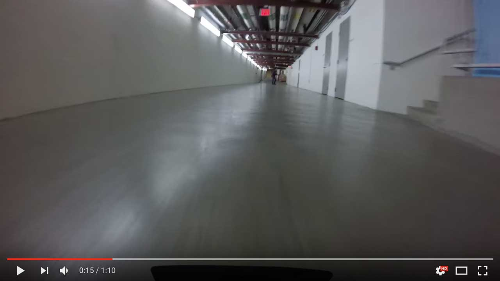

# RSS 2018 - Lab 6

This code is the starter code for Lab 6 - Path Planning and Trajectory Following

[](https://www.youtube.com/watch?v=pBX_JONXpN8?t=12s)

This video uses similar code, but it is extended to include variable speed trajectories:
[https://www.youtube.com/watch?v=9fzzp6oxid4](https://www.youtube.com/watch?v=9fzzp6oxid4)

## Installation

You will need the map_server, recordclass, and scikit-image.

```
pip install recordclass
# this one will take a while
pip install scikit-image
```

Run the following in the root of the workspace containing this module:

```
sudo apt-get update
rosdep install -r --from-paths src --ignore-src --rosdistro kinetic -y
```

## Usage

### Pure Pursuit only 

You have to run teleoperation, localization, and pure pursuit trajectory following nodes.

```
# For the car
roslaunch racecar teleop.launch
roslaunch lab5_localize localize.launch
roslaunch lab6 follow_trajectory.launch

# For simulation
roslaunch headless_simulator simulate.launch
roslaunch lab6 follow_trajectory.launch
```

Once those are running, you can use the trajectory loader node to initialize pure pursuit with a trajectory.

```
roslaunch lab6 trajectory_loader.launch
```

### Pure Pursuit + Path planning: Waypoint based control

You have to run teleoperation, localization, pure pursuit trajectory following, and path planning nodes.

```
# For the car
roslaunch racecar teleop.launch
roslaunch lab5_localize localize.launch
roslaunch lab6 follow_trajectory.launch
roslaunch lab6 waypoint_control.launch

# For simulation
roslaunch headless_simulator simulate.launch
roslaunch lab6 follow_trajectory.launch
roslaunch lab6 waypoint_control.launch
```

## PlanningLibC

I wanted to see how writing a Python wrapper for a C++ library works, so I implemented occupancy grid utils in C++.

An important primitive is the ```Point2``` object, which is templated into ```Point2f``` and ```Point2i```.
- ```Point2f``` objects are used for poses in continuous world space.
- ```Point2i``` objects are used for represented discrete coordinates in an occupancy grid.

```python
from PlanningLibC import *

# Create a point.
pt = Point2f(13.1, 1.7)
print(pt.x, pt.y)

# Calculate distance to another point.
pt2 = Point2f(14.7, 0.1)
dist = pt.distance(pt2) # Order doesn't matter for distance.

# Point comparison is supported.
Point2f(0.1, 0) == Point2f(0.1, 0) # True
Point2i(0, 0) != Point2i(0, 1) # True
```

The main class in PlanningLibC is the ```OccupancyGrid```. It's a wrapper around a ROS ```OccupancyGrid``` message that allows obstacle checking and some other useful operations. In general, operations can be done in grid coordinates or continuous coordinates, and conversions between the two are handled internally.

Frame convention:
- Point2f (x, y) coordinates are in the MAP frame.
- Grid cell row indices increase as y increases.
- Grid cell column indices increases as x increases.
- Grid cell (0, 0) is not necessarily at (0.0, 0.0) in the map frame, so PlanningLibC handles this translation internally.

See ```test/test_PlanningLibC.py``` for more API usage.

#### Creating an OccupancyGrid object
```python
import PlanningLibC as plc
from nav_msgs.msg import OccupancyGrid as OccupancyGridMsg # To avoid ambiguity.

# Create an example OccupancyGrid msg.
og = OccupancyGridMsg()
og.info.width = 100
og.info.height = 200
og.info.resolution = 0.1
og.data = [0 for _ in range(og.info.width * og.info.height)]

# Create an OccupancyGrid object (wrapper).
ogw = plc.OccupancyGrid(self.og)
```

#### Getting map metadata
```python
w = ogw.getMapWidth() # 100
h = ogw.getMapHeight() # 200
res = ogw.getMapResolution() # 0.1
w_m = ogw.getMapWidthMeters() # 10
h_m = ogw.getMapHeightMeters() # 20
```

#### Get/set OccupancyGrid cell data
*Note that cells have values between [-128, 127] (ROS stores an int8_t for each cell).*
```python
# Set the value of grid cell (0, 0) to 127.
ogw.setGridValue(plc.Point2i(0, 0), 127)

# Get the value of grid cell (0, 0).
val = ogw.getGridValue(plc.Point2i(0, 0)) # 127

# Set the value of grid cell corresponding to (7.3, 2.1) in the world frame to 126.
ogw.setPointValue(plc.Point2f(7.3, 2.1), 126)

# Get the value of grid cell corresponding to (7.3, 2.1) in the world frame.
val = ogw.getPointValue(plc.Point2f(7.3, 2.1)) # 126
```

#### Collision checking
PlanningLibC can check for collisions along the straight line between two points (used in RRT and others). Internally, Bresenham's Line Algorithm is used to figure out which grid cells to check for occupancy.
```python
ogw.pathOccupied(plc.Point2f(1.0, 2.0), plc.Point2f(1.7, 0.3))
```

#### Sampling from the map
```python
randPt = ogw.sampleOccupancyGrid()
```

#### Dilating the map
The function below takes in a radius of dilation, and internally modifies the map to be dilated. For a radius of 0.2m, for example, all cells within a 0.2m radius of an occupied cell become occupied.
```python
ogw.dilateOccupancyGrid(0.2) # Dilate the map by 20cm.
```

#### Get a ROS OccupancyGrid message
It may be useful to get a ROS msg representing the current map state.
```python
msg = ogw.getOccupancyGridMsg()
```
